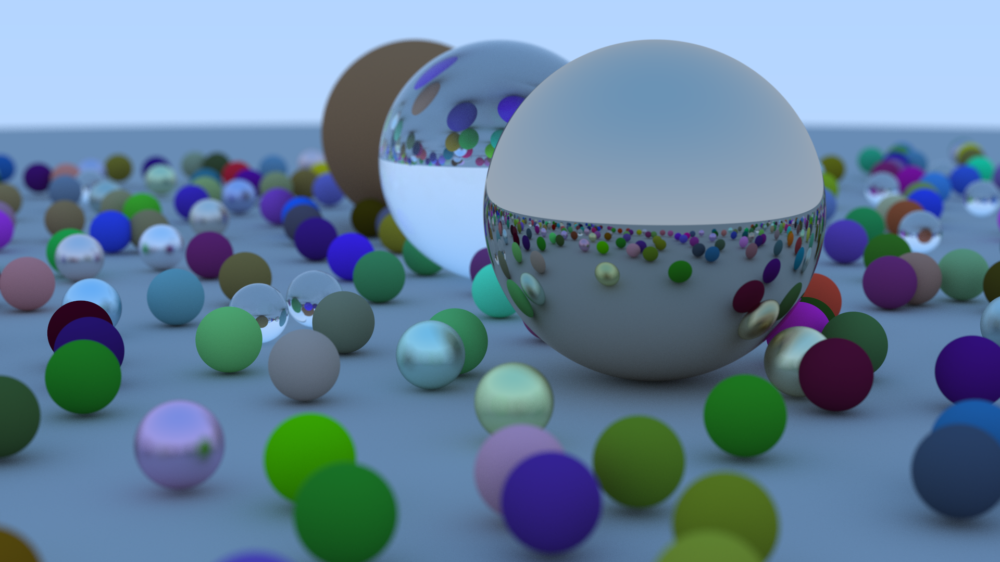

This is a simple ray tracer I built following ["Ray Tracing in One
Weekend"](https://raytracing.github.io/books/RayTracingInOneWeekend.html).

Here is an image I generated using the code snippet that the authors used to
produce their book cover:

As an additional exercise, I parallelised the rendering process, which allowed
me to use all the cores on my machine. If I have time, I'll do some benchmarks
and detail what the speed-up looked like.
